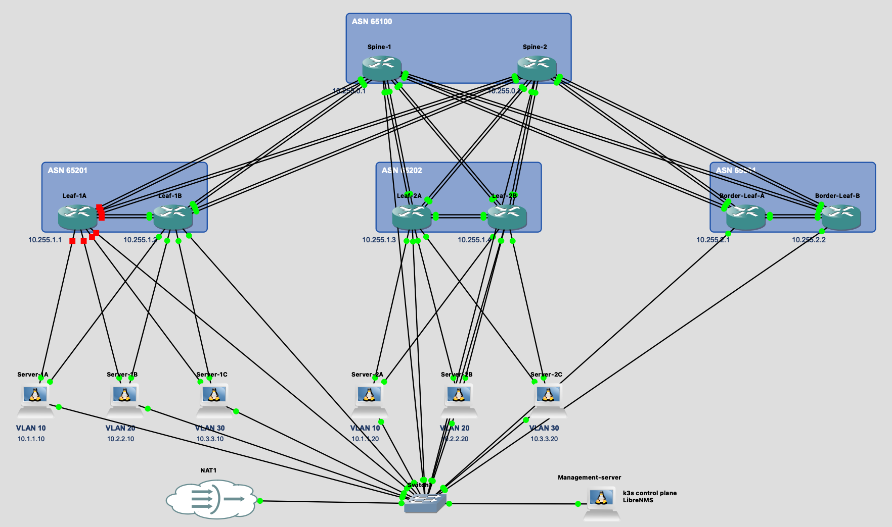
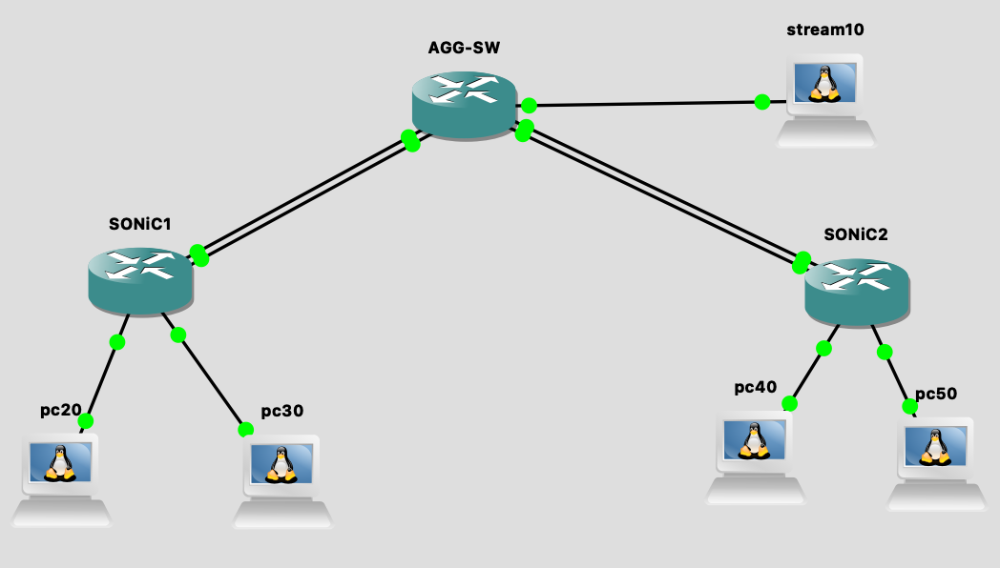

# SONiC Lite Upgrade from Version 1.13 to 1.14

## 1. Objective

The objective is to test and document the upgrade process of  
SONiC Lite from version **1.13** to version **1.14**.

The upgrade will be performed on the **Leaf-1B** switch in the existing
GNS3 topology.

The following environment is used for testing:

- **GNS3 Blueprint 0**
- **Switch: Leaf-1B**
- **Current SONiC version: SONiC-OS-Lite-1.13.0_202405-vs**

The upgrade will be performed using the `sonic-installer` utility
and a SONiC image in `.bin` format.

## Test Topologies

### Topology 1



### Topology 2



## Upgrade Issues

---

## 2. Initial State

The following configuration is used at the beginning of the test:

| Parameter | Value |
|---|---|
| Current SONiC version | SONiC-OS-Lite-1.13.0_202405-vs |
| Upgrade method | `sonic-installer` |
| New image format | `.bin` |
| Target version | SONiC-OS-Lite-1.14.0_202405-vs |

---

## 3. Checking the Current SONiC Version

Before starting the upgrade, the current system version must be checked.

```bash
show version
```
### 4.Image Update

> The output shows the SONiC VS update

1. Copy the SONiC image to the switch using rsync:
    Run the following command on the GNS3 host, replacing the source path and switch IP address with the actual values:
    ```bash
    rsync -avP /home/admin/sonic-vs-1.14.0.bin admin@192.168.122.3:/home/admin/
    ```
2. Check the file availability:

    ```bash
    admin@sonic:~$ ls
    sonic-vs-1.14.0.bin
    ```
3. Check the current images:
    ```bash
    admin@sonic:~$ sudo sonic-installer list
    Current: SONiC-OS-Lite-1.13.0_202405-vs
    Next: SONiC-OS-Lite-1.13.0_202405-vs
    Available: 
    SONiC-OS-Lite-1.13.0_202405-vs
    ```
4. Run the `sonic-installer` to update the image:

    ```bash
    sudo sonic-installer install sonic-vs-1.14.0.bin -y
    admin@leaf-1b:~$ sudo sonic-installer install sonic-vs-1.14.0.bin 
    New image will be installed, continue? [y/N]: y
    efi not supported - exiting without verification

    Installing image SONiC-OS-lite_1.14.0.0-dirty-20261008.125234 and setting it as default...
    Command: bash ./sonic-vs-1.14.0.bin
    Verifying image checksum ... OK.
    Preparing image archive ... OK.
    Installing SONiC in SONiC
    ONIE Installer: platform: x86_64-vs-r0
    onie_platform: x86_64-kvm_x86_64-r0
    Installing SONiC to /host/image-lite_1.14.0.0-dirty-20261008.125234
    Archive:  fs.zip
    creating: /host/image-lite_1.14.0.0-dirty-20261008.125234/boot/
    inflating: /host/image-lite_1.14.0.0-dirty-20261008.125234/boot/System.map-6.1.0-22-2-amd64  
    inflating: /host/image-lite_1.14.0.0-dirty-20261008.125234/boot/initrd.img-6.1.0-22-2-amd64  
    inflating: /host/image-lite_1.14.0.0-dirty-20261008.125234/boot/vmlinuz-6.1.0-22-2-amd64  
    inflating: /host/image-lite_1.14.0.0-dirty-20261008.125234/boot/config-6.1.0-22-2-amd64  
    extracting: /host/image-lite_1.14.0.0-dirty-20261008.125234/fs.squashfs  
    ONIE_IMAGE_PART_SIZE=32768
    EXTRA_CMDLINE_LINUX=
    Switch CPU vendor is: GenuineIntel
    Switch CPU cstates are: disabled
    cp /tmp/tmp.gn733PCnaY /boot/efi/EFI/debian/grub.cfg
    EXTRA_CMDLINE_LINUX=
    Installed SONiC base image SONiC-OS successfully

    Command: grub-set-default --boot-directory=/host 0

    Command: config-setup backup
    Taking backup of current configuration

    Command: mkdir -p /tmp/image-lite_1.14.0.0-dirty-20261008.125234-fs
    Command: mount -t squashfs /host/image-lite_1.14.0.0-dirty-20261008.125234/fs.squashfs /tmp/image-lite_1.14.0.0-dirty-20261008.125234-fs
    Command: sonic-cfggen -d -y /tmp/image-lite_1.14.0.0-dirty-20261008.125234-fs/etc/sonic/sonic_version.yml -t /tmp/image-lite_1.14.0.0-dirty-20261008.125234-fs/usr/share/sonic/templates/sonic-environment.j2
    Command: umount -r -f /tmp/image-lite_1.14.0.0-dirty-20261008.125234-fs
    Command: rm -rf /tmp/image-lite_1.14.0.0-dirty-20261008.125234-fs
    Command: mkdir -p /tmp/image-lite_1.14.0.0-dirty-20261008.125234-fs
    Command: mount -t squashfs /host/image-lite_1.14.0.0-dirty-20261008.125234/fs.squashfs /tmp/image-lite_1.14.0.0-dirty-20261008.125234-fs
    Command: mkdir -p /host/image-lite_1.14.0.0-dirty-20261008.125234/rw
    Command: mkdir -p /host/image-lite_1.14.0.0-dirty-20261008.125234/work
    Command: mkdir -p /tmp/image-lite_1.14.0.0-dirty-20261008.125234-fs
    Command: mount overlay -t overlay -o rw,relatime,lowerdir=/tmp/image-lite_1.14.0.0-dirty-20261008.125234-fs,upperdir=/host/image-lite_1.14.0.0-dirty-20261008.125234/rw,workdir=/host/image-lite_1.14.0.0-dirty-20261008.125234/work /tmp/image-lite_1.14.0.0-dirty-20261008.125234-fs
    Command: mkdir -p /tmp/image-lite_1.14.0.0-dirty-20261008.125234-fs/var/lib/docker
    Command: mount --bind /host/image-lite_1.14.0.0-dirty-20261008.125234/docker /tmp/image-lite_1.14.0.0-dirty-20261008.125234-fs/var/lib/docker
    Command: chroot /tmp/image-lite_1.14.0.0-dirty-20261008.125234-fs mount proc /proc -t proc
    Command: chroot /tmp/image-lite_1.14.0.0-dirty-20261008.125234-fs mount sysfs /sys -t sysfs
    Command: cp /tmp/image-lite_1.14.0.0-dirty-20261008.125234-fs/etc/default/docker /tmp/image-lite_1.14.0.0-dirty-20261008.125234-fs/tmp/docker_config_backup
    Command: sh -c echo 'DOCKER_OPTS="$DOCKER_OPTS -H unix:// --storage-driver=overlay2 --bip=240.127.1.1/24 --iptables=false --ipv6=true --fixed-cidr-v6=fd00::/80 "' >> /tmp/image-lite_1.14.0.0-dirty-20261008.125234-fs/etc/default/docker
    Command: chroot /tmp/image-lite_1.14.0.0-dirty-20261008.125234-fs /usr/lib/docker/docker.sh start
    mount: /sys/fs/cgroup/cpu: cgroup already mounted on /sys/fs/cgroup.
       dmesg(1) may have more information after failed mount system call.
    mount: /sys/fs/cgroup/cpuacct: cgroup already mounted on /sys/fs/cgroup.
       dmesg(1) may have more information after failed mount system call.
    Command: cp /var/lib/sonic-package-manager/packages.json /tmp/image-lite_1.14.0.0-dirty-20261008.125234-fs/tmp/packages.json
    Command: mkdir -p /var/lib/sonic-package-manager/manifests
    Command: cp -arf /var/lib/sonic-package-manager/manifests /tmp/image-lite_1.14.0.0-dirty-20261008.125234-fs/var/lib/sonic-package-manager
    Command: touch /tmp/image-lite_1.14.0.0-dirty-20261008.125234-fs/tmp/docker.sock
    Command: mount --bind /var/run/docker.sock /tmp/image-lite_1.14.0.0-dirty-20261008.125234-fs/tmp/docker.sock
    Command: cp /tmp/image-lite_1.14.0.0-dirty-20261008.125234-fs/etc/resolv.conf /tmp/resolv.conf.backup
    Command: cp /etc/resolv.conf /tmp/image-lite_1.14.0.0-dirty-20261008.125234-fs/etc/resolv.conf
    Command: chroot /tmp/image-lite_1.14.0.0-dirty-20261008.125234-fs sh -c command -v sonic-package-manager
    Command: chroot /tmp/image-lite_1.14.0.0-dirty-20261008.125234-fs sonic-package-manager migrate /tmp/packages.json --dockerd-socket /tmp/docker.sock -y
    +q544e+q524742+q636f6c6f7273+q626c696e6b+q7369746d+q7269746d+q6376766973+q536d756c78+q536574756c63+q4d73+q544e+q524742+q636f6c6f7273+q626c696e6b+q7369746d+q7269746d+q6376766973+q536d756c78+q536574756c63+q4d73migrating package dhcp-relay
    skipping dhcp-relay as installed version is newer
    migrating package dhcp-server
    skipping dhcp-server as installed version is newer
    migrating package macsec
    skipping macsec as installed version is newer
    Command: chroot /tmp/image-lite_1.14.0.0-dirty-20261008.125234-fs /usr/lib/docker/docker.sh stop
    Command: mv /tmp/image-lite_1.14.0.0-dirty-20261008.125234-fs/tmp/docker_config_backup /tmp/image-lite_1.14.0.0-dirty-20261008.125234-fs/etc/default/docker
    Command: cp /tmp/resolv.conf.backup /tmp/image-lite_1.14.0.0-dirty-20261008.125234-fs/etc/resolv.conf
    Command: umount -f -R /tmp/image-lite_1.14.0.0-dirty-20261008.125234-fs
    Command: umount -r -f /tmp/image-lite_1.14.0.0-dirty-20261008.125234-fs
    Command: rm -rf /tmp/image-lite_1.14.0.0-dirty-20261008.125234-fs
    Command: sync
    Command: sync
    Command: sync
    Command: sleep 3
    Done
    ```
5. Check the images again:
    ```bash
    Current: SONiC-OS-Lite-1.13.0_202405-vs
    Next: SONiC-OS-lite_1.14.0.0-dirty-20261008.125234
    Available: 
    SONiC-OS-lite_1.14.0.0-dirty-20261008.125234
    SONiC-OS-Lite-1.13.0_202405-vs
    ```
    In the list you can see the new image and in the `Next` section the image will be updated. This section shows which image will be used on next boot.

    To apply the new image, reboot the system:
    ```bash
    admin@leaf-1b:~$ sudo reboot
    ```

    After reboot you will see the new applied image:
    ```bash
    admin@leaf-1b:~$ sudo sonic-installer list
    Current: SONiC-OS-lite_1.14.0.0-dirty-20261008.125234
    Next: SONiC-OS-lite_1.14.0.0-dirty-20261008.125234
    Available:
    SONiC-OS-lite_1.14.0.0-dirty-20261008.125234
    SONiC-OS-Lite-1.13.0_202405-vs
    ```
    The `config_db.json`, Redis configuration and FRR will be saved.
    Before updating we used next command in order to save of FRR config after reboot: 
    ```bash 
    sudo redis-cli -n 4 HSET "DEVICE_METADATA|localhost" "docker_routing_config_mode" "split"
    sudo config save -y
    ```
    The local files and variables will be missed.


>[!WARNING]
> **Upgrade Failure — Insufficient RAM**
>
> During the first upgrade attempt, the Leaf-1B switch was configured with **4096 MB of RAM** and no swap space. The upgrade process failed due to insufficient memory. The system encountered a kernel panic:
>
> ```text
> Kernel panic - not syncing: Out of memory: compulsory panic_on_oom is enabled
> ```
>
> **Result:** The switch automatically rebooted and loaded the previous image:
`SONiC-OS-Lite-1.13.0_202405-vs`.
>**Resolution:** The virtual switch's RAM allocation was increased from 4096 MB to 8192 MB before retrying the upgrade.
